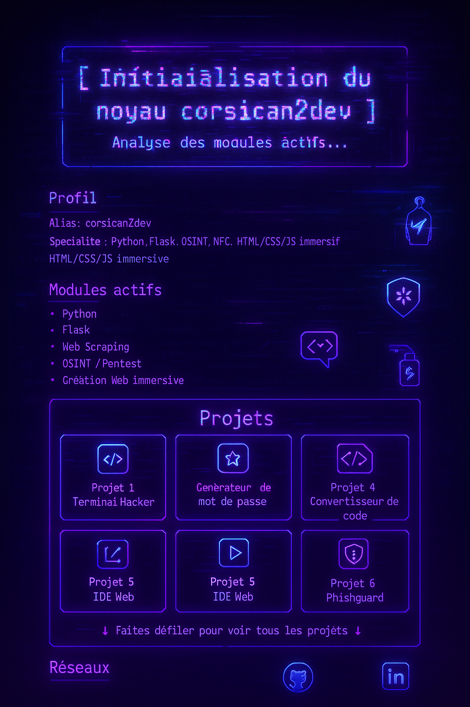

  

# CyberMe - corsican2dev

Bienvenue dans mon interface immersive type cyberpunk.  
Ce portfolio a été conçu pour me présenter comme une entité scannée dans un monde dystopique.

## 🧠 Projets en ligne

- [Terminal Hacker](https://www.corsican2dev.fr/projets/terminal-hacker)
- [Générateur de mot de passe](https://www.corsican2dev.fr/projets/generateur-mdp)
- [Quiz Développeur](https://www.corsican2dev.fr/projets/quiz-dev)
- [Convertisseur de code](https://www.corsican2dev.fr/projets/convertisseur-code)
- [IDE Web](https://www.corsican2dev.fr/projets/ide-web)
- [Phishguard](https://github.com/Corsican2Dev/phishguard) 🛡️ – *Outil d’analyse de phishing*

## Technologies
- HTML, CSS, JavaScript
- Effets glitch, néon et animation
- Responsive + sons d'interface

## Voir la démo
🚀 Disponible mainteant ici : https://corsican2dev.github.io/CyberMe/

